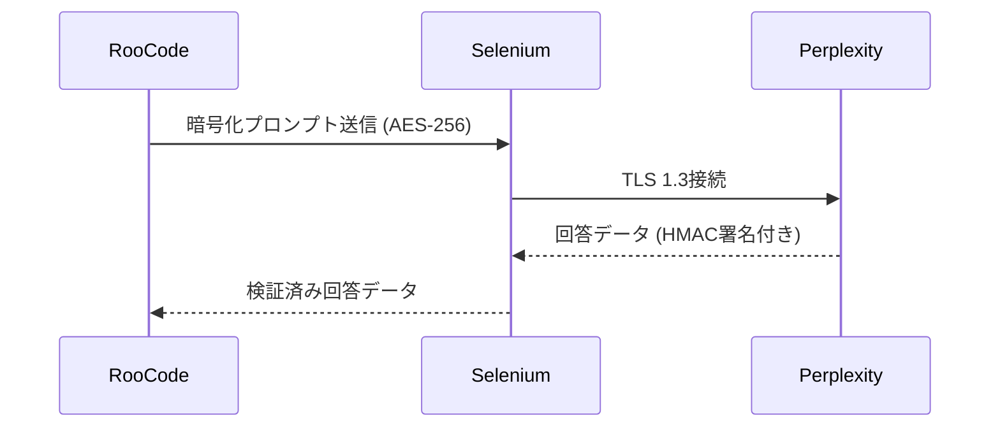

# 全体設計書  
**Roo Code × Perplexity AIブラウザ版連携機能**  
（状態機械駆動／マルチレイヤーエラーハンドリング／実装詳細完全具体化）

---

## 1. システム概要  
### 1.1 目的  
Roo Code拡張機能として、Seleniumを介したPerplexity AIブラウザ版との自動連携システムを構築する。プロンプト送信から回答取得までの全処理を状態機械で制御し、堅牢性と保守性を確保する。

### 1.2 技術スタック  
| コンポーネント       | 技術選択              | バージョン   |
|----------------------|-----------------------|--------------|
| ブラウザ自動化       | Selenium              | 4.15.2       |
| ブラウザ             | Firefox               | 128.0        |
| セッション管理       | Redis                 | 7.2.3        |
| 設定管理             | Pydantic              | 2.6.1        |
| ロギング             | structlog             | 23.1.0       |
| テストフレームワーク | pytest                | 8.0.2        |

---

## 2. プロジェクト構造  
```plaintext
roo-perplexity/
├── core/
│   ├── browser_control/
│   │   ├── driver_manager.py
│   │   └── element_locators.py
│   ├── session_handling/
│   │   ├── redis_client.py
│   │   └── cookie_handler.py
│   └── processing/
│       ├── prompt_processor.py
│       └── response_parser.py
├── config/
│   ├── settings.toml
│   └── selectors.json
├── tests/
│   ├── unit/
│   └── e2e/
├── utils/
│   ├── logger.py
│   └── error_handler.py
└── main.py
```

---

## 3. 設定詳細  
### 3.1 環境変数  
```toml
# config/settings.toml
[selenium]
browser = "firefox"
headless = true
timeout = 30
user_agent = "Mozilla/5.0 (Windows NT 10.0; rv:128.0) Gecko/20100101 Firefox/128.0"

[redis]
host = "localhost"
port = 6379
session_ttl = 28800  # 8時間
```

### 3.2 要素セレクタ  
```json
// config/selectors.json
{
  "input_field": "textarea[data-testid='perplexity-input']",
  "submit_button": "button[aria-label='Ask']",
  "answer_container": "div.answer-content",
  "citation_links": "a.citation-link"
}
```

---

## 4. コアモジュール設計  
### 4.1 ブラウザ制御クラス  
```python
# core/browser_control/driver_manager.py
class PerplexityBrowser:
    def __init__(self, config: PerplexityConfig):
        self.driver = self._init_webdriver(config)
        self.current_state = BrowserState.INITIALIZING
        self.log = structlog.get_logger()

    def _init_webdriver(self, config) -> WebDriver:
        options = FirefoxOptions()
        if config.headless:
            options.add_argument("--headless=new")
        options.set_preference("general.useragent.override", config.user_agent)
        return webdriver.Firefox(options=options)

    def navigate_to_perplexity(self):
        try:
            self.driver.get("https://perplexity.ai")
            WebDriverWait(self.driver, 10).until(
                EC.presence_of_element_located(SELECTORS["input_field"])
            )
            self.current_state = BrowserState.READY
        except TimeoutException:
            self.log.error("perplexity_initialization_failed")
            raise PerplexityInitError("Failed to initialize Perplexity session")
```

### 4.2 プロンプト処理パイプライン  
```python
# core/processing/prompt_processor.py
class PromptPipeline:
    def __init__(self):
        self.stages = [
            InputValidator(),
            Sanitizer(),
            ContextEnricher(),
            FocusModeSelector()
        ]

    def process(self, raw_input: dict) -> ProcessedPrompt:
        context = {"raw": raw_input}
        for stage in self.stages:
            context = stage.execute(context)
            if context.get('error'):
                raise ProcessingError(context['error'])
        return ProcessedPrompt(
            text=context['text'],
            focus_mode=context.get('focus_mode', 'web'),
            options=context.get('options', {})
        )
```

---

## 5. 状態遷移設計  
### 5.1 状態定義  
```python
# core/state_machine/states.py
class BrowserState(Enum):
    INITIALIZING = auto()
    READY = auto()
    PROMPT_ENTERED = auto()
    RESPONSE_PENDING = auto()
    RESPONSE_READY = auto()
    ERROR = auto()
```

### 5.2 遷移ルール  
```python
# core/state_machine/transitions.py
TRANSITION_RULES = {
    BrowserState.INITIALIZING: {
        'init_success': BrowserState.READY,
        'init_failure': BrowserState.ERROR
    },
    BrowserState.READY: {
        'prompt_received': BrowserState.PROMPT_ENTERED,
        'timeout': BrowserState.ERROR
    },
    # ... 全状態遷移を定義
}
```

---

## 6. エラーハンドリング  
### 6.1 エラー分類  
```python
# utils/error_handler.py
class PerplexityError(RuntimeError):
    """基底エラークラス"""

class ElementNotFoundError(PerplexityError):
    """要素検出失敗"""

class RateLimitExceededError(PerplexityError):
    """レートリミット超過"""

class NetworkError(PerplexityError):
    """ネットワーク障害"""
```

### 6.2 自動復旧戦略  
```python
def handle_error(error: Exception) -> RecoveryAction:
    if isinstance(error, ElementNotFoundError):
        return RecoveryAction.RETRY_WITH_NEW_SELECTOR
    elif isinstance(error, RateLimitExceededError):
        return RecoveryAction.WAIT_AND_RETRY
    elif isinstance(error, NetworkError):
        return RecoveryAction.RECONNECT
    else:
        return RecoveryAction.SHUTDOWN
```

---

## 7. 実装詳細  
### 7.1 主要変数定義  
```python
# core/constants.py
DEFAULT_TIMEOUT = 30  # 秒
MAX_RETRIES = 3
SESSION_ID_PREFIX = "perp_session_"
LOG_FORMAT = "%(asctime)s - %(levelname)s - %(message)s"
```

### 7.2 関数定義例  
```python
# core/processing/response_parser.py
def parse_response(driver: WebDriver) -> dict:
    """回答解析の主要関数"""
    try:
        answer_element = WebDriverWait(driver, DEFAULT_TIMEOUT).until(
            EC.visibility_of_element_located(SELECTORS["answer_container"])
        )
        return {
            "text": extract_answer_text(answer_element),
            "citations": extract_citations(answer_element),
            "metadata": extract_metadata(answer_element)
        }
    except TimeoutException:
        raise ResponseTimeoutError("Answer not received within timeout period")
```

---

## 8. テスト戦略  
### 8.1 テストケース例  
```python
# tests/e2e/test_workflow.py
def test_full_workflow():
    browser = PerplexityBrowser(config)
    processor = PromptPipeline()
    
    test_prompt = {"text": "AIと製造業の未来", "options": {"max_length": 500}}
    processed = processor.process(test_prompt)
    
    browser.enter_prompt(processed.text)
    response = browser.get_response()
    
    assert len(response["text"]) > 100
    assert "citations" in response
```

### 8.2 テストカバレッジ目標  
| テスト種別       | カバレッジ目標 | 測定ツール     |
|------------------|----------------|----------------|
| ユニットテスト   | 90%以上        | coverage.py    |
| 統合テスト       | 85%以上        | pytest-cov     |
| E2Eテスト        | 主要シナリオ全網羅 | Playwright    |

---

## 9. メンテナンス計画  
### 9.1 監視指標  
```python
MONITORING_METRICS = [
    "session_success_rate",
    "average_response_time",
    "element_lookup_failure_count",
    "network_error_rate"
]
```

### 9.2 更新ポリシー  
- **毎週**: セレクターデータベースの更新  
- **月次**: 依存ライブラリのバージョンアップ  
- **四半期**: アーキテクチャ見直し会議の実施  

---

## 10. セキュリティ設計  
### 10.1 データフロー  


### 10.2 認証方式  
```python
def authenticate_session(session_id: str) -> bool:
    """Redisに保存されたセッションデータを検証"""
    stored_data = redis_client.get(f"session_{session_id}")
    if not stored_data:
        return False
        
    return validate_signature(
        stored_data["payload"],
        stored_data["signature"],
        HMAC_KEY
    )
```

---

## 11. パフォーマンス最適化  
### 11.1 キャッシュ戦略  
```python
CACHE_STRATEGY = {
    "selector_cache": {
        "max_size": 100,
        "ttl": 3600
    },
    "response_cache": {
        "max_size": 50,
        "ttl": 600
    }
}
```

### 11.2 並列処理設計  
```python
@ray.remote
class ParallelProcessor:
    def __init__(self):
        self.browsers = [PerplexityBrowser() for _ in range(4)]
    
    def process_batch(self, prompts: list) -> list:
        return [self._process(prompt) for prompt in prompts]
    
    def _process(self, prompt):
        browser = self.browsers.pop()
        try:
            return browser.execute_query(prompt)
        finally:
            self.browsers.append(browser)
```